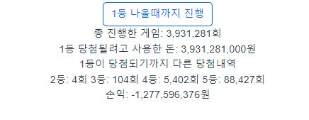
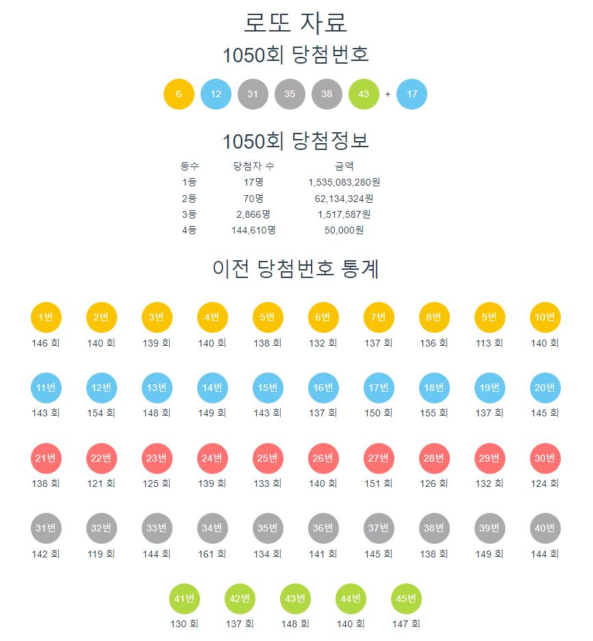

# jamddo - 재미로 해보는 로또 시뮬레이션

## :date: 프로젝트 진행 기간
2022.11.21 ~ 2023.01.31

## ✔ 서비스 소개
로또 시뮬레이션을 진행해볼 수 있는 웹사이트 입니다.

## ✔ 사용 기술
Frontend: Vue

Backend: SpringBoot, JPA, Querydsl

Database: MySQL

Infra: Docker

## ✔ 기능 소개
- 시뮬레이션 기능
    - 하나의 로또를 구매할 수 있습니다. 로그인 상태라면 본인의 포인트가 차감 또는 증가합니다.
        
        
        
    - N개의 로또를 구매할 수 있습니다. N개 번호를 모두 확인해 볼 수도 있고 N개의 번호 중 당첨된 내역의 번호만 확인하는 것도 가능합니다.

        
        
    - 1등이 당첨될 때까지 구매를 진행해 볼 수 있습니다. 1등이 당첨되기 위해 얼마의 시도가 있었고 1등 이외의 당첨이 몇번 일어났는지 알려줍니다.
        
        
        
- 통계정보 제공
    - 페이지에 접속하면 이번주 당첨번호, 이번주 상금 정보, 역대 당첨번호에 대한 통계값을 제공합니다.
        
        

## ✔ 고민한 내용
- DB와의 통신을 최소화하는 구조에 대해 고민했습니다. 초기 구조는 로또를 구매할 때마다 번호를 생성하고 DB에서 현재 회차의 당첨번호를 받아와 등수를 확인했었습니다. 이러한 방식은 매번 DB에 접근해야 한다는 문제가 있었고 이를 개선하기 위해 로또를 구매하는 기능과 점수를 계산하는 기능을 분리하고 DB에서 당첨번호를 생성자 호출 시점에 전역변수로 선언해 DB에 접근하는 횟수를 줄였습니다.

## ✔ 문제 상황과 해결 과정
- 멀티 쓰레드 환경에서 Querydsl의 데드락 현상을 겪고 이를 해결했습니다. 자세한 설명은 <a href="">블로그<a/>에 기록해 뒀습니다.
