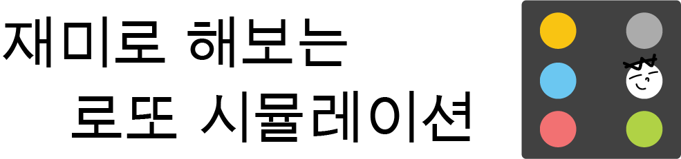
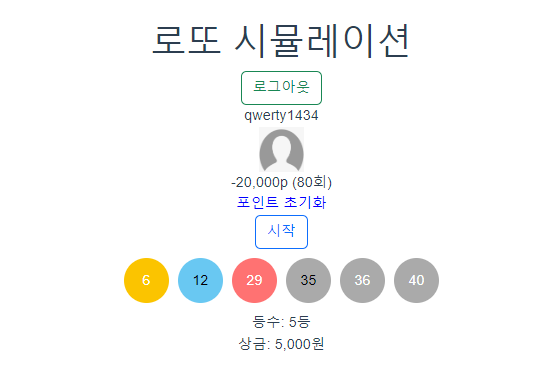
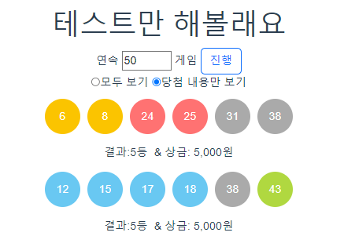

# jamddo - 재미로 해보는 로또 시뮬레이션

## :date: 프로젝트 진행 기간
2022.11.21 ~ 2023.01.31

## ✔ 서비스 소개
로또 시뮬레이션을 진행해볼 수 있는 웹사이트 입니다.

## ✔ 사용 기술
Frontend
- Vue

Backend
- SpringBoot, JPA, Querydsl

Database
- MySQL

Infra
- Docker, EC2

## ✔ 기능 소개
### 시뮬레이션 기능
- 시뮬레이션 기능
    - 1부터 45 사이 6개의 숫자를 임의로 생성한 뒤 로또 당첨번호와 비교해 점수를 계산합니다.
    로그인 상태라면 구매 시 1000point가 감소하고, 당첨 시 당첨 금액만큼 point가 증가합니다.
    로그인 하지 않은 상태라면 point 변화 없이 구매 기능을 이용할 수 있습니다.
- 통계정보 제공 기능
    - 페이지 접근 시 1등 정보와 통계정보를 반환해 줍니다. 이번주 당첨번호, 이번주 상금 정보, 역대 당첨번호 통계 정보를 제공합니다.
### 통계정보 제공 기능
- 페이지 접근 시 1등 정보와 통계정보를 반환해 줍니다. 이번주 당첨번호, 이번주 상금 정보, 역대 당첨번호 통계 정보를 제공합니다.

## ✔ 고민한 내용
- DB와의 통신을 최소화하는 구조에 대해 고민했습니다. 초기 구조는 로또를 구매할 때마다 번호를 생성하고 DB에서 현재 회차의 당첨번호를 받아와 등수를 확인했었습니다. 이러한 방식은 매번 DB에 접근해야 한다는 문제가 있었고 이를 개선하기 위해 로또를 구매하는 기능과 점수를 계산하는 기능을 분리하고 DB에서 당첨번호를 생성자 호출 시점에 전역변수로 선언해 DB에 접근하는 횟수를 줄였습니다.
- 프로젝트의 방향성을 고민했습니다. 잼또는 기존에 협업으로 진행하면서 배웠던 기술들을 활용해보기 위해 시작한 프로젝트입니다. 협업에서 담당하지 않았던 부분들을 직접 개발해보는 게 주된 목적이었기 때문에 새로운 기술을 적용하거나 프론트엔드 작업에 많은 시간을 투자하지 않고 웹 개발의 기본이 되는 스프링 프레임워크와 JPA를 활용하는 부분을 중점적으로 작업했습니다.

## ✔ 문제 상황과 해결 과정
- 작업을 진행하면서 Querydsl의 데드락 현상을 겪었었습니다. 프론트에서 vue lifecycle의 created시점에 axios로 여러 통계 정보를 요청했을 때 간헐적으로 요청이 실패하는 문제가 발생했었습니다.  
원인을 파악하기 위해 조건을 바꿔가면서 실험을 진행한 결과 statistic페이지와 simulation페이지 중 statistic페이지를 먼저 접속한 경우, statistic페이지의 4가지 api요청 중 overview를 포함해 둘 이상의 api요청을 보낼 때 문제가 발생한다는 걸 파악했습니다.   
하지만 api에 대한 단위 테스트에서는 문제가 발생하지 않았다는 점과 overview api를 단일로 요청할 때는 문제가 발생하지 않았다는 걸 이상하게 생각해 멀티 쓰레드 환경에서 비동기 방식으로 api를 요청하는 단위 테스트를 추가로 진행했고, 동일한 문제가 발생하는 걸 통해 멀티 쓰레드와 관련된 문제라는 걸 확인할 수 있었습니다.  
이를 근거로 querydsl의 멀티 쓰레드 환경에 대해 조사했고, querydsl의 공식 문서를 통해 ‘Q타입이 순환 의존을 가질 경우, 멀티 쓰레드 환경에서 Q타입을 초기화하면 데드락이 발생할 수 있다’는 내용을 확인할 수 있었습니다.   
저는 postConstructor시점에 ClassPathUtils의 scanPackage메서드를 사용해 멀티 쓰레드 환경 이전에 단일 쓰레드에서 클래스를 초기화하는 방식으로 데드락을 방지해 문제를 해결했고, 겪었던 내용을 정리한 뒤 [블로그](https://velog.io/@qwerty1434/%EB%A9%80%ED%8B%B0%EC%93%B0%EB%A0%88%EB%93%9C-%ED%99%98%EA%B2%BD%EC%97%90%EC%84%9C-querydsl-%EC%82%AC%EC%9A%A9%ED%95%98%EA%B8%B0)에 기록해 지식을 공유했습니다.  

## ✔ 화면 구성

